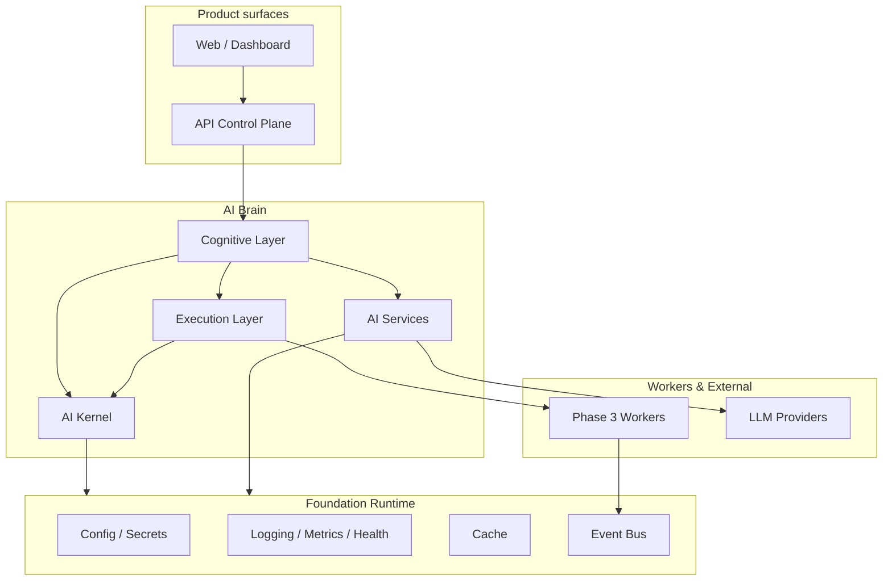
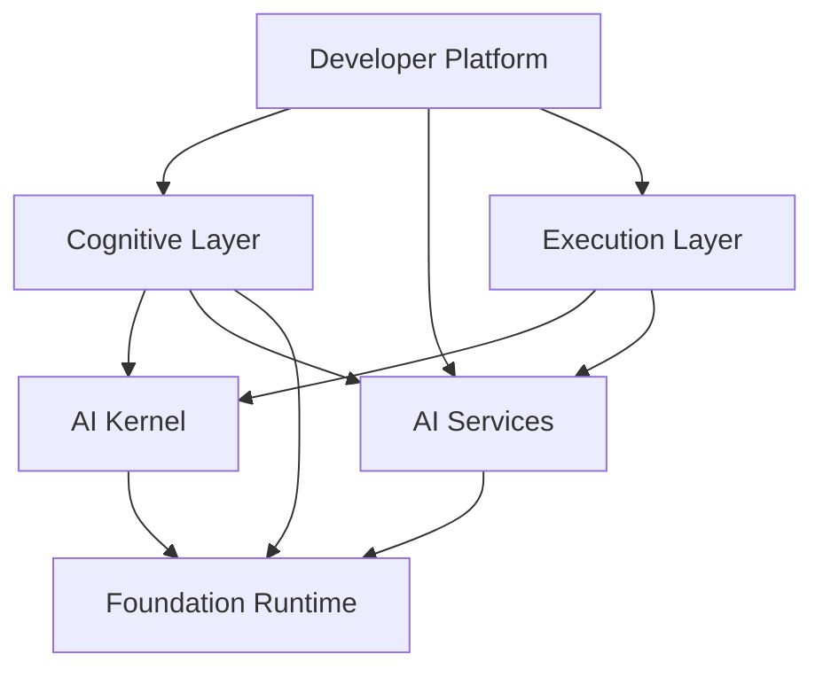
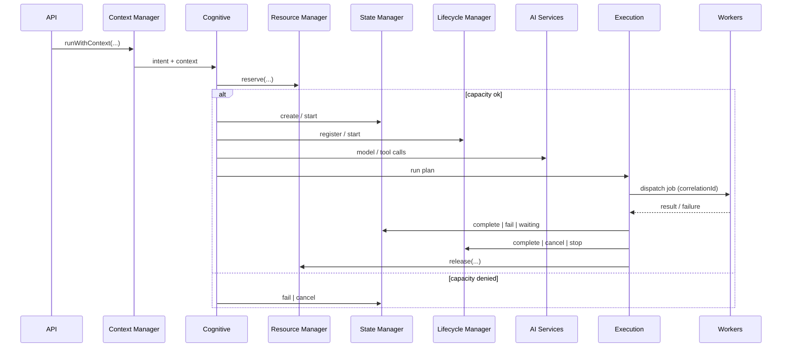
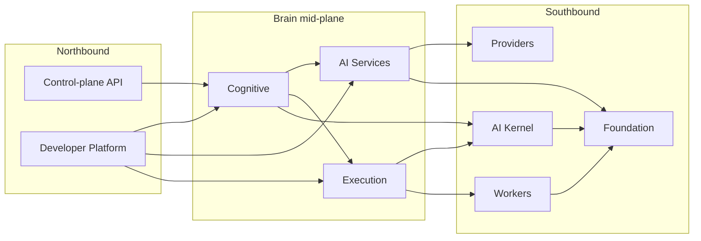
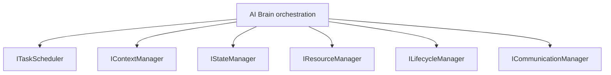
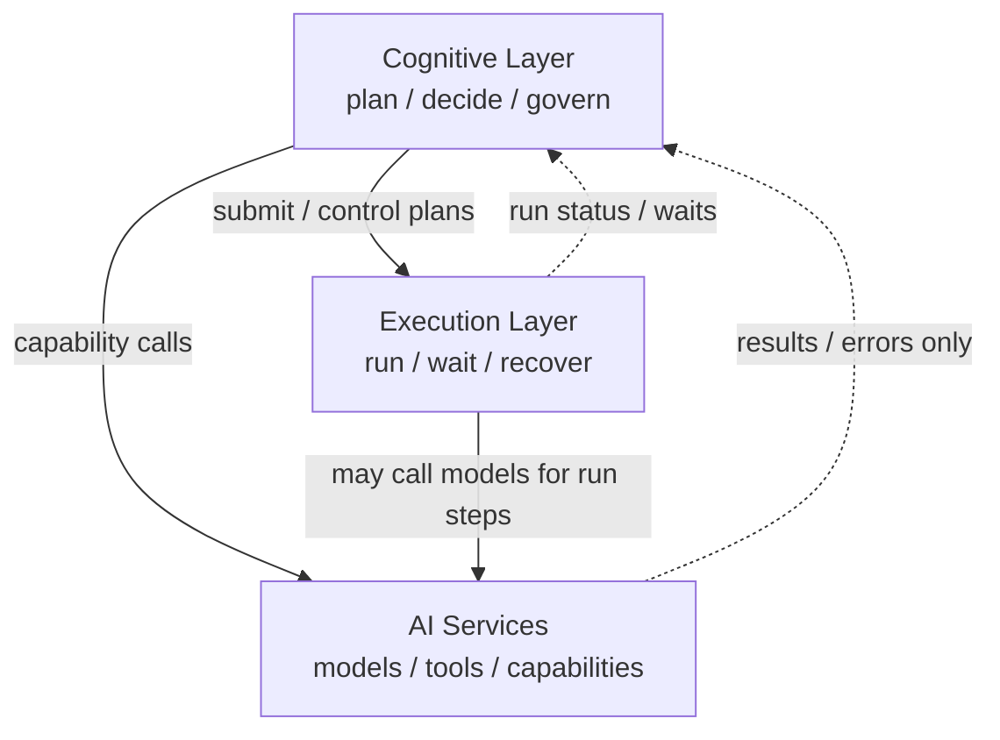
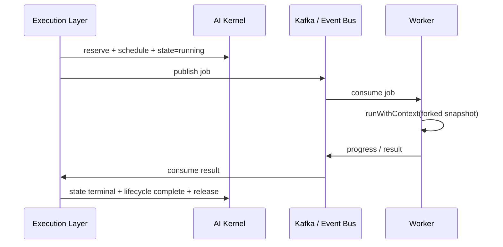
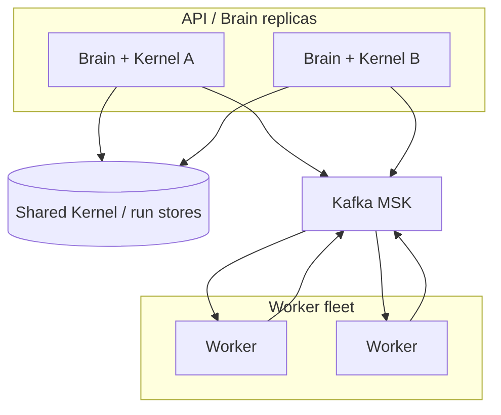

# AI Brain Architecture

**Audience:** Engineers building on the AI Operating System  
**Status:** Living architecture document  
**Date:** 2026-08-04  
**Related:** [`architecture.md`](./architecture.md) · [`ai-kernel-ownership.md`](./ai-kernel-ownership.md)

This document describes the **AI Brain**: the layered AI Operating System that sits on the
AI-TOS cloud foundation and turns authenticated platform requests into governed cognition,
model calls, and durable execution across services and workers.

---

## 1. AI-TOS Overview

**AI-TOS** (AI Trading Operating System) is a modular, cloud-native platform. The product
roadmap (identity → gateway → knowledge → agents → markets) runs on a shared **AI OS**
control plane.

| Concern | What it is |
|---|---|
| **Platform foundation** | Monorepo, EKS, RDS, Redis, Kafka, OTel, CI/CD (Phase 0 / 0B) |
| **Identity** | Orgs, auth, RBAC, API keys, sessions, audit (Phase 1) |
| **AI Operating System** | Runtime services + AI Kernel + Cognitive / Services / Execution planes |
| **AI Brain** | The composed intelligence stack: Kernel + Cognitive + AI Services + Execution (+ Workers) |

The Brain does **not** replace Kafka, Postgres, or the Nest API. It **orchestrates** how AI
work is scheduled, contextualized, reasoned about, invoked, and executed with clear ownership.



---

## 2. Layer Architecture

Layers are **dependency-ordered**. Lower layers must not import upper-layer domain logic.
Upper layers call lower layers through **contracts** (interfaces / tokens), not ad-hoc internals.

### 2.1 Foundation Runtime (AI OS Layer 1)

**Role:** Cross-cutting platform services every AI OS component relies on.

| Capability | Responsibility |
|---|---|
| Configuration | Typed, validated runtime config |
| Secrets | Safe retrieval / rotation hooks |
| Logging | Structured, redacted logs |
| Metrics | Counters, histograms, Prometheus export |
| Health | Liveness / readiness / component checks |
| Cache | Namespaced get/set/invalidate |
| Event Bus | In-process typed publish/subscribe (kernel / cognitive / AI / execution / workers topics) |

**Status:** Complete. Treat as frozen unless fixing defects.

### 2.2 AI Kernel (AI OS Layer 2)

**Role:** In-process **control plane** for scheduling, context, state, resources, lifecycle, and internal messaging.

| Manager | Owns |
|---|---|
| Task Scheduler | When work units run (queue, priority, delay, retry, timeout, cancel) |
| Context Manager | Runtime request / user / org / pipeline / worker context + propagation |
| State Manager | Execution state machine |
| Resource Manager | Workers / model slots / memory / concurrency reservations |
| Lifecycle Manager | Start / pause / resume / stop / cancel / complete |
| Communication Manager | Service/worker messaging, P2P, broadcast, request/response |

**Contracts:** `ITaskScheduler`, `IContextManager`, `IStateManager`, `IResourceManager`,
`ILifecycleManager`, `ICommunicationManager` (+ storage `I*Store` backends).

**Detail:** [`ai-kernel-ownership.md`](./ai-kernel-ownership.md)

**Status:** Layer 2 complete (managers + storage abstraction + ownership + service contracts).
Default stores are in-memory (single-process).

### 2.3 Cognitive Layer

**Role:** The Brain’s **reasoning and planning** plane — decide *what* should happen next.

#### 2.3.1 Perception Engine (Layer 3.1) — ✅ Implemented

**Role:** Transform raw user input into a standardized `WorldUnderstanding`. **Understanding only.**

| Rule | Perception NEVER |
|---|---|
| Scope | Think · Decide · Plan · Execute · Retrieve Memory · Call AI Providers · Call Workers |

**Pipeline:** Input Gateway → Perception Processor → Understanding Processor → World Model Builder → Output Standardizer

**Public API:** `IPerceptionService.perceive(input) → WorldUnderstanding` (`PERCEPTION_SERVICE` token)

**Module:** `apps/api/src/modules/perception` · Events: `perception.started` / `perception.completed` / `perception.failed`

**Status:** Layer 3.1 complete.

#### 2.3.2 Thinking Engine (Layer 3.2) — ✅ Implemented

**Role:** Transform `WorldUnderstanding` into a standardized `Thought`. **Thinking only.**

| Rule | Thinking NEVER |
|---|---|
| Scope | Decide · Create execution plans · Execute · Call workers · Allocate resources · Schedule tasks |

**Pipeline:** Context Builder → Knowledge Synthesizer → Reasoning Core → Critical Evaluator → Thought Composer

**Public API:** `IThinkingService.think(worldUnderstanding) → Thought` (`THINKING_SERVICE` token)

**Module:** `apps/api/src/modules/thinking` · Events: `thinking.started` / `thinking.completed` / `thinking.failed`

**Status:** Layer 3.2 complete.

#### 2.3.3 Decision Engine (Layer 3.3) — ✅ Implemented

**Role:** Transform `Thought` into a standardized `Decision`. **Commitment only — one course of action.**

| Rule | Decision NEVER |
|---|---|
| Scope | Perform reasoning · Create execution strategies · Execute · Allocate resources · Schedule tasks · Call workers · Call AI providers |

**Pipeline:** Evidence Validator → Constraint Validator → Judgment Core → Commitment Manager

**Public API:** `IDecisionService.decide(thought) → Decision` (`DECISION_SERVICE` token)

**Module:** `apps/api/src/modules/decision` · Events: `decision.started` / `decision.completed` / `decision.failed`

**Status:** Layer 3.3 complete.

#### 2.3.4 Planning Engine (Layer 3.4) — ✅ Implemented

**Role:** Transform `Decision` into a standardized `ExecutionBlueprint`. **Strategy design only.**

| Rule | Planning NEVER |
|---|---|
| Scope | Execute · Schedule · Allocate resources · Start workers · Call AI providers · Make decisions · Perform reasoning |

**Pipeline:** Strategy Designer → Task Decomposer → Dependency Designer → Execution Blueprint Builder

**Public API:** `IPlanningService.plan(decision) → ExecutionBlueprint` (`PLANNING_SERVICE` token)

**Module:** `apps/api/src/modules/planning` · Events: `planning.started` / `planning.completed` / `planning.failed`

**Status:** Layer 3.4 complete.

#### 2.3.5 Output Engine (Layer 3.5) — ✅ Implemented

**Role:** Transform `ExecutionBlueprint` into a standardized `ExecutionIntent`. **Handoff preparation only.**

| Rule | Output NEVER |
|---|---|
| Scope | Execute · Decide · Reason · Create plans · Schedule · Allocate · Call workers · Call AI providers |

**Pipeline:** Intent Consolidator → Capability Resolver → Execution Contract Builder → Transition Validator

**Public API:** `IOutputService.buildOutput(executionBlueprint) → ExecutionIntent` (`OUTPUT_SERVICE` token)

**Module:** `apps/api/src/modules/output` · Events: `output.started` / `output.completed` / `output.failed`

**Status:** Layer 3.5 complete.

### Layer 3 Cognitive Layer — ✅ COMPLETE

End-to-end cognitive pipeline:

`perceive` → `think` → `decide` → `plan` → `buildOutput`

Produces a validated `ExecutionIntent` ready for later execution layers.

#### 2.3.6 Further orchestration (target / Layer 4+)

Responsibilities (target):

- Consume `ExecutionIntent` in AI Services / Execution planes
- Bind Kernel scheduling, resources, and lifecycle
- Emit execution events for observability

Does **not** own: cognitive understanding / thinking / decision / planning / output contracts (frozen in Layer 3).

### 2.4 AI Services

**Role:** **Capability plane** — model gateway, embeddings, tools, specialized AI APIs, and durable experience storage.

#### 2.4.1 Memory Service (Layer 4.1) — ✅ Implemented

**Role:** Preserve and manage **experiences across time**. Stores experiences, **not** knowledge.

| Rule | Memory NEVER |
|---|---|
| Scope | Think · Reason · Decide · Plan · Execute · Call AI models · RAG / enterprise knowledge · Talk directly to databases |

**Lifecycle:** Experience → Evaluator → Remember? → Store → Index → Recall → Update → Archive → Forget

**Stores:** Session Memory · Long-term Memory · Episodic Memory via **IMemoryProvider** (storage-independent)

**Public API:** `IMemoryService` — `remember` / `recall` / `update` / `forget` / `archive` / `search` (`MEMORY_SERVICE` token)

**Module:** `apps/api/src/modules/memory` · Events: `memory.remembered` / `updated` / `archived` / `forgotten` / `failed`

**Status:** Layer 4.1 complete.

#### 2.4.2 Knowledge Service (Layer 4.2) — ✅ Implemented

**Role:** Manage discoverable **facts/documents** (not experiences). Provider-independent knowledge ingest and retrieval.

| Rule | Knowledge NEVER |
|---|---|
| Scope | Think · Reason · Plan · Decide · Execute AI models · Generate embeddings · Store experiences · Call model providers |

**Lifecycle:** Source → Document Loader → Parser → Index Manager → Store → Retrieval Engine → Response

**Public API:** `IKnowledgeService` — `ingest` / `retrieve` / `search` / `update` / `delete` / `list` (`KNOWLEDGE_SERVICE` token)

**Module:** `apps/api/src/modules/knowledge` · Events: `knowledge.ingested` / `updated` / `deleted` / `retrieved` / `search.completed` / `failed`

**Embeddings:** abstracted via `IEmbeddingCapabilityPort` (Capability Service is the capability plane; Knowledge does not embed).

**Status:** Layer 4.2 complete.

#### 2.4.3 Capability Service (Layer 4.3) — ✅ Implemented

**Role:** Provider-independent **capability abstraction**. The AI Brain requests capabilities — never models.

| Rule | Capability NEVER |
|---|---|
| Scope | Think · Reason · Plan · Decide · Call AI vendors · Authenticate providers · Store memory/knowledge · Execute business workflows |

**Pipeline:** Controller → Registry → Resolver → Router → Orchestrator → `ICapabilityProvider`

**Public API:** `ICapabilityService.execute(request) → CapabilityResult` (`CAPABILITY_SERVICE` token) — unified contract only

**Module:** `apps/api/src/modules/capability` · Events: `capability.started` / `completed` / `failed` / `cancelled`

**Ports (abstract only):** Memory · Knowledge · Model · Tool · Integration · Policy

**Status:** Layer 4.3 complete.

#### 2.4.4 Model Service (Layer 4.4) — ✅ Implemented

**Role:** Provider-independent **inference plane**. Executes models through adapters. Capability selection stays in Capability Service.

| Rule | Model NEVER |
|---|---|
| Scope | Think · Reason · Plan · Decide · Choose capabilities · Store memory/knowledge · Run business workflows · Call Capability/Memory/Knowledge/Tool/Integration/Policy services |

**Pipeline:** Controller → Provider Registry → Authentication Manager → Provider Adapter → Inference Executor → Health Monitor → Usage Collector

**Public API:** `IModelService.infer(request) → ModelResponse` (`MODEL_SERVICE` token) — unified contract only

**Module:** `apps/api/src/modules/model` · Events: `model.inference.started` / `completed` / `failed` · `provider.registered` / `unhealthy` / `recovered`

**Adapters:** stub abstractions for OpenAI · Anthropic · Gemini · Azure OpenAI · Bedrock · Ollama · vLLM · Local (no vendor SDKs in this phase)

**Status:** Layer 4.4 complete.

#### 2.4.5 Tool Service (Layer 4.5) — ✅ Implemented

**Role:** Deterministic **computational / local execution** tools. Never reasons, never runs AI inference, never connects to enterprise SaaS (Integration Service owns SaaS).

| Rule | Tool NEVER |
|---|---|
| Scope | Think · Reason · Plan · Decide · Call AI models · Store memory/knowledge · Connect to SaaS · Authenticate · Schedule · Retry · Own cache |

**Pipeline:** Controller → Registry → Resolver → Executor → `IToolAdapter`

**Public API:** `IToolService.execute(request) → ToolResult` (`TOOL_SERVICE` token) — unified contract only

**Module:** `apps/api/src/modules/tool` · Events: `tool.started` / `completed` / `failed` / `cancelled` / `registered`

**Status:** Layer 4.5 complete.

#### 2.4.6 Integration Service (Layer 4.6) — ✅ Implemented

**Role:** Enterprise **communication plane** via provider-independent connectors. Never reasons, never runs AI inference, never performs deterministic tool computation.

| Rule | Integration NEVER |
|---|---|
| Scope | Think · Reason · Plan · Decide · Call AI models · Store memory/knowledge · Deterministic compute · Schedule · Retry · Own cache |

**Pipeline:** Controller → Registry → Resolver → Connection Lifecycle Manager → `IConnectorAdapter`

**Public API:** `IIntegrationService.execute(request) → IntegrationResult` (`INTEGRATION_SERVICE` token) — unified contract only

**Module:** `apps/api/src/modules/integration` · Events: `integration.started` / `completed` / `failed` · `connector.registered` / `connected` / `disconnected` / `authentication.failed` / `recovered`

**Connectors:** stub abstractions only (no vendor SDKs in this phase)

**Status:** Layer 4.6 complete.

#### 2.4.7 Policy Service (Layer 4.7) — ✅ Implemented

**Role:** **Governance plane** — define, compose, resolve, and expose Effective Policies. Never enforces; enforcement belongs to higher execution layers.

| Rule | Policy NEVER |
|---|---|
| Scope | Think · Reason · Plan · Decide · Execute models · Enforce policies · Authenticate/Authorize · Store memory/knowledge · Schedule · Retry |

**Pipeline:** Controller → Registry → Composer → Resolver → Conflict Resolver → Effective Policy Builder → `IPolicyProvider`

**Public API:** `IPolicyService.resolve(request) → EffectivePolicy` (`POLICY_SERVICE` token) — unified contract only

**Module:** `apps/api/src/modules/policy` · Events: `policy.resolution.started` / `completed` / `failed` · `policy.registered` / `updated` / `version.created`

**Status:** Layer 4.7 complete. **AI Services Layer 4 (4.1–4.7) COMPLETE.**

### 2.5 Execution Layer

**Role:** **Run plane** — turn plans into durable, observable runs across processes.

#### 2.5.1 Workflow Engine (Layer 5.1) — ✅ Implemented

**Role:** **Compile plane** — transform `ExecutionIntent` into an immutable `ExecutableWorkflow`. Never executes tasks or manages runtime state.

| Rule | Workflow Engine NEVER |
|---|---|
| Scope | Execute tasks · Retry · Recover · Stream · Schedule · Finalize · Manage runtime task state |

**Pipeline:** Controller → Builder → Dependency Graph Builder → Validator → Execution Strategy Builder → Context Manager → Executable Workflow Builder

**Public API:** `IWorkflowService.createWorkflow(executionIntent) → ExecutableWorkflow` (`WORKFLOW_SERVICE` token) — unified contract only

**Module:** `apps/api/src/modules/workflow` · Events: `workflow.started` / `completed` / `failed` · Config: `WORKFLOW_*`

**Status:** Layer 5.1 complete. Layers 5.2–5.6 pending (do not implement until instructed).

#### 2.5.2 Task Manager (Layer 5.2) — ✅ Implemented

**Role:** **Task lifecycle plane** — transform immutable `ExecutableWorkflow` into immutable `ExecutableTaskCollection` and own task states until dispatch preparation. Never executes tasks.

| Rule | Task Manager NEVER |
|---|---|
| Scope | Execute · Retry · Recover · Stream · Finalize · Call models/tools/integrations |

**Pipeline:** Controller → Builder → Dependency Manager → Lifecycle Manager → Executable Task Builder → Dispatcher

**Public API:** `ITaskManagerService.createTasks(executableWorkflow) → ExecutableTaskCollection` (`TASK_MANAGER_SERVICE` token)

**Module:** `apps/api/src/modules/task-manager` · Events: `task.started` / `completed` / `failed` · Config: `TASK_*`

**Status:** Layer 5.2 complete. Layers 5.3–5.6 pending (do not implement until instructed).

#### 2.5.3 Parallel Executor (Layer 5.3) — ✅ Implemented

**Role:** **Execution plane** — run ready tasks concurrently via abstract workers while respecting dependencies, strategy, and resource limits. Never owns durable state.

| Rule | Parallel Executor NEVER |
|---|---|
| Scope | Create workflows/tasks · Retry · Recover · Stream · Finalize · Call models/tools/integrations directly |

**Pipeline:** Execution Controller → Dependency Resolver → Concurrency Coordinator → Worker Dispatcher → Resource Coordinator → Execution Monitor → Progress Publisher

**Public API:** `IParallelExecutorService.execute(executableTaskCollection) → ExecutionProgress` (`PARALLEL_EXECUTOR_SERVICE` token)

**Module:** `apps/api/src/modules/parallel-executor` · Events: `execution.started` / `progress` / `completed` / `failed` · Config: `EXECUTION_*`

**Status:** Layer 5.3 complete. Layers 5.4–5.6 pending (do not implement until instructed).

#### 2.5.4 Execution Reliability Engine (Layer 5.4) — ✅ Implemented

**Role:** **Reliability plane** — classify failures, coordinate retry/recovery, checkpoints, timeouts, cancellation, and circuit breaking. Never executes tasks.

| Rule | Reliability Engine NEVER |
|---|---|
| Scope | Execute tasks · Create workflows/tasks · Stream · Finalize · Call models/tools/integrations |

**Pipeline:** Reliability Controller → Failure Classifier → Retry Coordinator → Recovery Coordinator → Checkpoint Manager → Timeout Manager → Cancellation Manager → Circuit Breaker → Recovery State Builder

**Public API:** `IExecutionReliabilityService.handle(executionProgress) → ExecutionRecoveryState` (`EXECUTION_RELIABILITY_SERVICE` token)

**Module:** `apps/api/src/modules/reliability` · Events: `reliability.started` / `completed` / `failed` · Config: `RELIABILITY_*`

**Status:** Layer 5.4 complete. Layers 5.5–5.6 pending (do not implement until instructed).

#### 2.5.5 Streaming Engine (Layer 5.5) — ✅ Implemented

**Role:** **Streaming plane** — deliver real-time execution information through transport-independent streams. Never executes or finalizes.

| Rule | Streaming Engine NEVER |
|---|---|
| Scope | Execute · Retry · Recover · Manage workflows · Finalize · Call models/tools/integrations · Bind transport SDKs |

**Pipeline:** Streaming Controller → Stream Builder → Event Stream Manager → Output Stream Manager → Progress Stream Manager → Backpressure Manager → Subscription Manager → Stream Publisher

**Public API:** `IStreamingService.stream(executionProgress) → ExecutionStream` (`STREAMING_SERVICE` token)

**Module:** `apps/api/src/modules/streaming` · Events: `stream.started` / `progress` / `completed` / `failed` · Config: `STREAMING_*`

**Status:** Layer 5.5 complete. Layer 5.6 pending (do not implement until instructed).

#### 2.5.6 Execution Finalizer (Layer 5.6) — ✅ Implemented

**Role:** **Finalization plane** — produce one immutable `ExecutionResult` for a completed workflow. Never executes or streams.

| Rule | Execution Finalizer NEVER |
|---|---|
| Scope | Execute · Retry · Recover · Stream · Manage workflows · Manage task lifecycle · Call models/tools/integrations |

**Pipeline:** Finalization Controller → Result Collector → Result Validator → Result Composer → Execution Summary Builder → Metadata Builder → Execution Status Resolver → Execution Result Builder

**Public API:** `IExecutionFinalizerService.finalize(completedExecution) → ExecutionResult` (`EXECUTION_FINALIZER_SERVICE` token)

**Module:** `apps/api/src/modules/finalizer` · Events: `finalization.started` / `completed` / `failed` · Config: `FINALIZATION_*`

**Status:** Layer 5.6 complete. **Execution Layer 5 (5.1–5.6) COMPLETE.**

### 2.6 Developer Platform

**Role:** **Ergonomics and extensibility** for builders.

Responsibilities (target):

- SDKs / typed clients against Brain contracts
- Local scaffolds, fixtures, and contract tests
- Docs, examples, and extension points (tools, providers, workers)
- Safe defaults that respect Kernel ownership and Foundation runtime



---

## 3. AI Brain Responsibilities

The AI Brain is responsible for:

1. **Accepting** authenticated, contextualized AI work from the control-plane API.
2. **Planning** (Cognitive) what sequence of model / tool / worker steps is required.
3. **Governing** capacity and lifecycle through the Kernel (resources, state, pause/cancel).
4. **Invoking** AI Services for model and related capabilities.
5. **Executing** plans via the Execution Layer and Workers with correlation IDs.
6. **Observing** every stage via Foundation logging, metrics, health, and Event Bus topics.
7. **Isolating** failures so a provider outage or worker crash does not corrupt Kernel ownership rules.

The Brain is **not** responsible for:

- Replacing the platform Event backbone (Kafka / MSK) for cross-service durability
- Owning product UI or Identity/RBAC policy definition
- Inventing parallel task/state/lifecycle machines outside Kernel owners

---

## 4. Dynamic Request Pipeline

A typical dynamic request (chat, agent step, pipeline kickoff) flows as follows:

```text
API request
  → authenticate / authorize (Identity)
  → Context Manager: bind request + user + org (+ pipeline)
  → Cognitive: interpret intent → plan
  → Resource Manager: reserve capacity (or reject / degrade)
  → State Manager: create / transition execution
  → Lifecycle Manager: register + start
  → AI Services: model / tool calls (as planned)
  → Execution: schedule Kernel tasks / worker jobs
  → Communication / Event Bus: messages + domain events
  → terminal: complete|fail|cancel → release resources → unbind context
```



Pipeline properties:

- **Dynamic:** Cognitive may insert waits, retries, or alternate providers without changing Kernel ownership.
- **Correlated:** `requestId` / `correlationId` / execution id / task id link all events.
- **Cancelable:** Lifecycle `cancel` / `stop` and Scheduler cancel cooperate; Execution must release resources.

---

## 5. Layer Interaction Flow



**Rules of engagement:**

| From → To | Allowed interaction |
|---|---|
| Cognitive → Kernel | Context bind, state/lifecycle/resource/schedule via **contracts** |
| Cognitive → AI Services | Synchronous/streaming capability calls |
| Cognitive → Execution | Submit / pause / cancel plans |
| Execution → Kernel | Reserve, schedule tasks, transition state/lifecycle |
| Execution → Workers | Job dispatch + result correlation |
| AI Services → Kernel | Optional context read; must not own execution state |
| Any → Foundation | Config, secrets, logs, metrics, cache, event bus |

---

## 6. AI Brain ↔ Kernel Relationship

The Kernel is the Brain’s **operating system core**. The Brain is the composed intelligence
**on top of** that core.

| | AI Kernel | AI Brain |
|---|---|---|
| Scope | Scheduling, context, state, resources, lifecycle, messaging | Cognitive + Services + Execution (+ Workers) using the Kernel |
| API style | `I*` manager contracts + Event Bus topics `kernel.*` | Orchestration APIs / pipelines that **call** Kernel contracts |
| Persistence (today) | In-memory `I*Store` defaults | Will introduce durable run stores at Execution when multi-instance is required |
| Failure domain | Process-local control plane | Includes provider and worker failures |

**Invariant:** The Brain never bypasses Kernel ownership (see [`ai-kernel-ownership.md`](./ai-kernel-ownership.md)).
If Cognitive needs “pause this run,” it calls **Lifecycle Manager**, not a private flag on an AI Service.



---

## 7. Cognitive ↔ AI Services ↔ Execution

These three layers form the Brain’s **mid-plane**. They collaborate; they do not merge.



| Layer | Decides | Calls | Must not |
|---|---|---|---|
| **Cognitive** | What the plan is | AI Services, Execution, Kernel | Persist alternate execution state machines |
| **AI Services** | How to talk to providers | Foundation (secrets, metrics), optional context | Own lifecycle of Brain runs |
| **Execution** | How the plan runs to completion | Kernel, Workers, sometimes AI Services | Invent Cognitive policy |

**Hand-off pattern:**

1. Cognitive produces a **plan** (steps + constraints).
2. Execution **admits** the plan (resources + state + lifecycle).
3. Steps that need models call **AI Services**; steps that need compute/IO call **Workers**.
4. Results flow back to Execution → State/Lifecycle → Cognitive (if further planning is needed).

---

## 8. Phase 3 Workers Integration

In the AI OS sense, **Phase 3 Workers** are the durable, horizontally scalable **execution edge**:
market, risk, news, scheduler, and future AI job workers.

### Integration contract

| Concern | Mechanism |
|---|---|
| Dispatch | Execution Layer enqueues work (Kafka / worker queues as platform dictates) |
| Correlation | `correlationId`, execution id, task id in payload + headers |
| Context | Portable snapshot from Context Manager `fork()`; worker rebinds via `runWithContext` |
| Progress | Worker emits events; Execution updates **State Manager** (`running` / `waiting` / terminal) |
| Messaging | Optional Kernel Communication Manager for in-process peers; **Kafka** for cross-process |
| Capacity | Resource Manager reservations before dispatch; release on terminal |



### Worker rules

- Workers are **stateless relative to Kernel memory** — they must not assume process-local Maps.
- Workers treat Kernel Communication Manager as optional local IPC; **cross-pod** work uses the platform event backbone.
- Product Phase 3 (Knowledge / RAG) may add ingestion workers; they still obey this integration pattern.

---

## 9. Design Principles

1. **Layered ownership** — One writer per concern (Kernel matrix is authoritative).
2. **Contracts over concretes** — Depend on `I*` tokens; swap implementations without rewriting Brain logic.
3. **Context everywhere ambient, nowhere persisted as truth** — Context propagates; State/Lifecycle persist execution truth.
4. **Reserve then run** — Capacity first; side effects second.
5. **Events are observations** — `kernel.*` / `cognitive.*` / `execution.*` do not transfer ownership.
6. **Fail closed on capacity and auth** — Prefer reject / degrade over silent overcommit.
7. **Phase discipline** — Do not implement future Brain layers inside Kernel PRs.
8. **Foundation reuse** — Logging, metrics, config, secrets, cache, bus are shared; do not fork them per layer.
9. **Horizontal readiness without premature distribution** — Interfaces and ownership first; shared stores when Execution needs multi-instance.
10. **Developer clarity** — Prefer obvious orchestration over clever cross-layer shortcuts.

---

## 10. Future Scalability

### Current posture (honest)

| Dimension | Today | Implication |
|---|---|---|
| Kernel stores | In-memory | Single process; restart loses Kernel bags |
| Event Bus (Kernel) | In-process | Not a cross-pod bus |
| Brain mid-plane | Largely forthcoming | Cognitive / Execution / full AI Services orchestration still expanding |

### Target multi-instance model



**Required evolutions (Execution / platform — not Layer 2 reopen):**

1. **Pluggable Kernel stores** already exist (`I*Store`) — add Redis/Postgres-backed implementations when HA is required.
2. **Admission control** across replicas via shared Resource Manager backend + quotas per org.
3. **Durable execution log** for pause/resume and crash recovery.
4. **Idempotent worker consumers** (Kafka keys + DLQ) for exactly-once *business* effects where needed.
5. **Sticky vs stealable work** policies for long runs (lease / heartbeat).
6. **Backpressure** from Resource Manager into Cognitive admission.

Until those land, treat the Kernel as a **correct single-node control plane** with contracts ready for distribution.

---

## References

| Doc | Purpose |
|---|---|
| [`architecture.md`](./architecture.md) | Platform / monorepo overview |
| [`ai-kernel-ownership.md`](./ai-kernel-ownership.md) | Kernel manager ownership + flow |
| [`project/MASTER_ROADMAP.md`](./project/MASTER_ROADMAP.md) | Product phase roadmap |
| [`project/PROJECT_STATUS.md`](./project/PROJECT_STATUS.md) | Current delivery status |
| `apps/api/src/modules/kernel/` | Kernel implementation + contracts |

---

## Change control

- Documentation-only updates unless a phase explicitly implements a Brain layer.
- Do not contradict Kernel ownership without a superseding decision in `docs/project/DECISIONS.md`.
