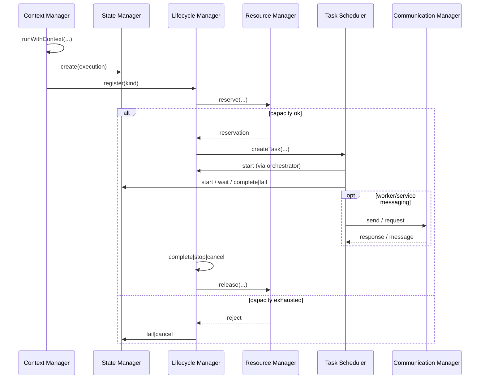

# AI Kernel — Ownership Model (Layer 2)

**Status:** Accepted  
**Phase:** 2.2 (AI Kernel)  
**Date:** 2026-08-04  
**Scope:** In-process AI Kernel control plane (`apps/api` → `KernelModule`)

This document defines **who owns what** inside the AI Kernel and the intended
**execution flow** between managers. Upper layers (Cognitive, AI Services,
Execution, Workers) must respect these boundaries.

Storage backends are abstracted via `I*Store` interfaces (Layer 2 Improvement 1).
Default implementations are in-memory; ownership rules do not change with storage.

---

## Ownership matrix

| Manager | Owns (source of truth) | Does **not** own |
|---|---|---|
| **Task Scheduler** | Task scheduling: queueing, priority/FIFO, delays, retries, timeouts, cancellation of **scheduled work units** | Execution state machine, lifecycle phases, resource capacity, messaging, runtime context |
| **State Manager** | **Execution state**: pending → scheduled → running → waiting → completed / failed / cancelled | Task queue timing, lifecycle pause/resume semantics, resource slots, messaging |
| **Resource Manager** | **Resource allocation**: workers, model slots, memory limits, concurrency limits, reservations | Task execution, state transitions, lifecycle phases, messaging, context |
| **Lifecycle Manager** | **Execution lifecycle**: created → running ↔ paused → stopped / cancelled / completed | Scheduler queue, fine-grained execution waiting state, resource math, messaging |
| **Communication Manager** | **Internal messaging**: service/worker endpoints, point-to-point, broadcast, request/response routing | Scheduling, state, resources, lifecycle, context propagation |
| **Context Manager** | **Runtime context**: request / user / organization / pipeline / worker context and async propagation | Persistence of executions, scheduling, resources, messaging payloads |

### One-line rules

- **Task Scheduler** decides *when* work runs.
- **State Manager** records *where an execution is* in the execution state machine.
- **Lifecycle Manager** controls *operator lifecycle actions* (start / pause / resume / stop / cancel / complete).
- **Resource Manager** decides *whether capacity exists* and holds reservations.
- **Communication Manager** moves *messages* between kernel participants.
- **Context Manager** carries *who/what/where* across async boundaries.

---

## Boundary rules

1. **Single writer per concern**  
   Only the owning manager mutates its domain records. Other managers may *read* or *request* actions; they must not invent parallel state for the same concern.

2. **Correlation, not duplication**  
   Cross-link entities with `refId` / `correlationId` / task id / execution id. Do not copy full state machines across managers.

3. **State vs Lifecycle**  
   - Use **State Manager** for execution progress (including `waiting` on external work).  
   - Use **Lifecycle Manager** for controllable run lifecycle (especially `pause` / `resume` / `stop`).  
   Layer 3 orchestration may drive both; neither replaces the other.

4. **Scheduler vs State**  
   Task Scheduler’s task states (`pending` / `scheduled` / `running` / …) describe **queue items**.  
   State Manager’s execution states describe **business/execution records**. Keep them separate unless an orchestrator explicitly binds them.

5. **Resources before run**  
   Work that consumes workers / models / memory / concurrency should **reserve** via Resource Manager before Lifecycle `start` / Scheduler execution, and **release** on terminal outcomes.

6. **Context is ambient**  
   Context Manager does not persist executions. Callers bind context (`runWithContext` / `fork`) around scheduler, lifecycle, and messaging work so events and logs inherit identity.

7. **Communication is transport**  
   Communication Manager does not authorize business outcomes. Handlers that receive messages must call the owning manager to change state, lifecycle, or resources.

---

## Execution flow (canonical)

Happy-path orchestration expected of Layer 3 / callers (not hard-wired inside Layer 2 today):

```text
1. Context Manager
   └─ bind request / user / org / pipeline / worker context

2. State Manager
   └─ create execution (pending)  [optional: scheduled]

3. Lifecycle Manager
   └─ register lifecycle (created) for task|execution

4. Resource Manager
   └─ reserve workers / model slots / memory / concurrency
   └─ on failure → State fail / Lifecycle cancel; stop

5. Task Scheduler
   └─ createTask (optional delay/priority)
   └─ handler runs when due

6. Lifecycle Manager + State Manager (during run)
   └─ Lifecycle: start → (pause ↔ resume)* → complete|stop|cancel
   └─ State: scheduled → running → (waiting ↔ running)* → completed|failed|cancelled

7. Communication Manager (as needed)
   └─ service/worker P2P, broadcast, or request/response
   └─ handlers update State / Lifecycle / Resources via owners

8. Terminal cleanup
   └─ Resource Manager: release reservations
   └─ State / Lifecycle: terminal phase (completed|failed|cancelled|stopped)
   └─ Context: scope ends (ALS unbound)
```

### Sequence (mermaid)



---

## Event topics (observability only)

Managers emit Event Bus topics for observation. **Events are not ownership transfers.**

| Owner | Topic prefix (examples) |
|---|---|
| Task Scheduler | `kernel.task.*` |
| Context Manager | `kernel.context.*` |
| State Manager | `kernel.state.*` |
| Resource Manager | `kernel.resource.*` |
| Lifecycle Manager | `kernel.lifecycle.*` |
| Communication Manager | `kernel.comm.*` |

Subscribers may react, but durable mutations must go through the owning manager.

---

## Non-goals (Layer 2)

- Distributed / multi-replica shared kernel state (future Execution Layer + store backends).
- Automatic wiring of all six managers into one opaque “run” API (belongs to Layer 3 orchestration).
- Replacing Kafka / platform Event Bus with Communication Manager (Comm is in-process kernel messaging).

---

## References

- Implementation: `apps/api/src/modules/kernel/`
- Service contracts: `apps/api/src/modules/kernel/contracts/`
- Storage contracts: `apps/api/src/modules/kernel/storage/`
- Platform overview: [`docs/architecture.md`](./architecture.md)
- AI Brain (full OS): [`docs/AI_BRAIN_ARCHITECTURE.md`](./AI_BRAIN_ARCHITECTURE.md)
- Project status: [`docs/project/PROJECT_STATUS.md`](./project/PROJECT_STATUS.md)
