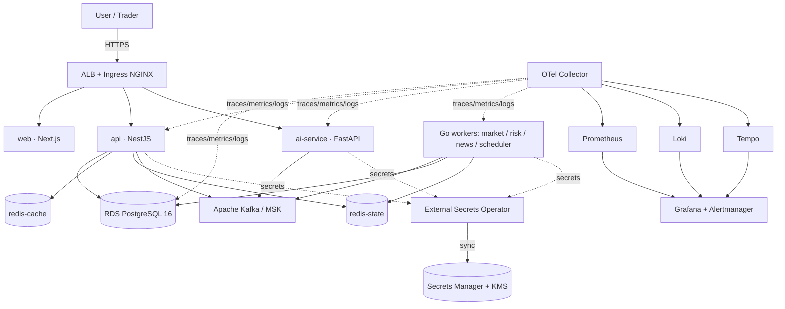
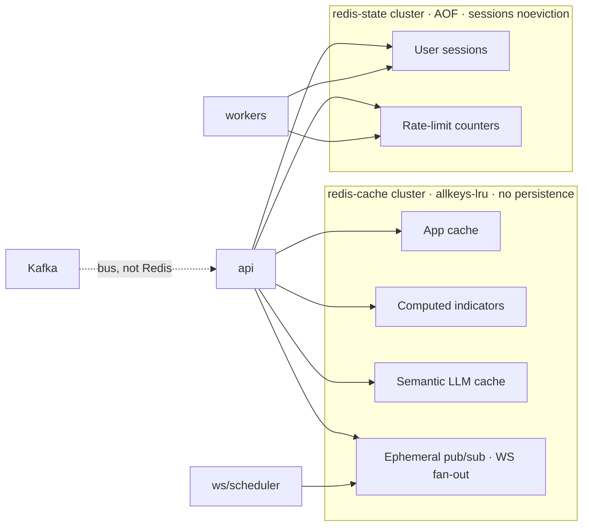
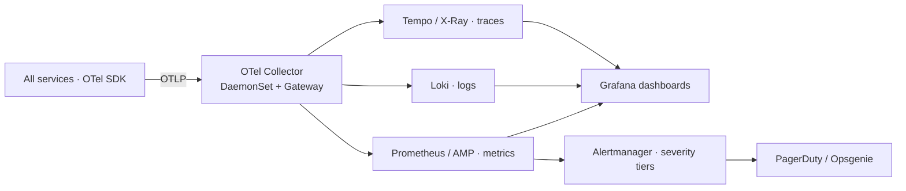
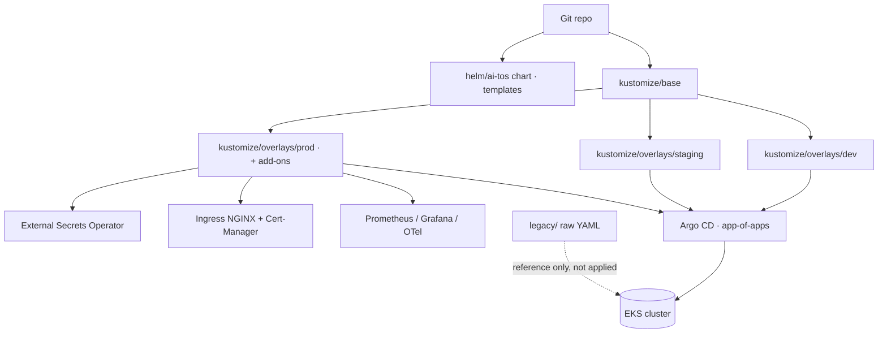
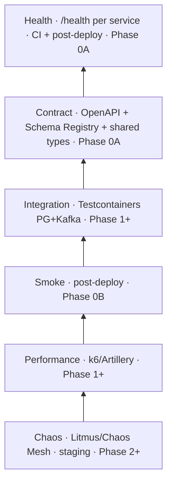

# Architecture Diagram Index

**AI-TOS · Phase 0A foundation (post Review Board changes) · 2026-07-30**
Diagrams are [Mermaid](https://mermaid.js.org) and render in GitHub/most Markdown viewers.
They reflect the **decisions** in ADRs 0004–0012 (architecture only; no Phase 0B provisioning).

## Index

| ID | Diagram | Covers | ADR |
|---|---|---|---|
| D1 | System context & layers | overall topology | plan/0004–0012 |
| D2 | Event backbone (Kafka + Outbox + DLQ) | Priority 1 | 0004 |
| D3 | Redis role separation | Priority 2 | 0005 |
| D4 | Data tier (RDS PostgreSQL + future TS) | Priority 3 | 0006 |
| D5 | Secrets flow (SM + KMS + ESO + IRSA) | Priority 6 | 0009 |
| D6 | Observability pipeline | Priority 7 | 0010 |
| D7 | CI/CD pipeline (OIDC + scanning + gated TF) | Priority 8 | 0011 |
| D8 | K8s delivery (Helm + Kustomize + Argo CD) | Priority 4 | 0007 |
| D9 | Testing pyramid | Priority 9 | 0012 |

---

### D1 — System context & layers


### D2 — Event backbone (Kafka + Outbox + DLQ)
```mermaid
sequenceDiagram
  participant S as Service (API/Worker)
  participant DB as PostgreSQL (_outbox)
  participant R as Outbox Relay (Debezium)
  participant K as Kafka (MSK)
  participant C as Consumer
  participant D as DLQ Topic
  S->>DB: BEGIN; write state + event to _outbox; COMMIT
  R->>DB: poll _outbox (CDC)
  R->>K: publish event (partition by key)
  K->>C: consume (consumer group, offset)
  alt success
    C->>C: idempotent handle (dedup key)
  else retry exhausted / poison
    C->>D: route to DLQ
  end
  Note over K: Schema Registry validates every event
```

### D3 — Redis role separation


### D4 — Data tier
```mermaid
flowchart TB
  APP[Services] --> PG[(RDS PostgreSQL 16 · primary OLTP<br/>Multi-AZ · KMS · PITR)]
  PG --> REP[(Read replica · portfolio/analytics)]
  REP --> RM[(CQRS read models · compute-on-write)]
  RM --> RC[(redis-cache · read cache)]
  Note over APP,RC: Phase 2+ : dedicated TS[(RDS + timescaledb)<br/>market ticks/candles] fed by logical replication
  Note right of PG: Aurora = future path only<br/>TimescaleDB ≠ primary
```

### D5 — Secrets flow
```mermaid
flowchart TB
  DEV[Developer / CI OIDC] -->|assume role| SM[(AWS Secrets Manager)]
  SM --> KMS[(KMS CMK · dedicated)]
  SM -->|automatic rotation 30-90d| LAM[Rotation Lambda]
  ESO[External Secrets Operator<br/>IRSA / OIDC] -->|GetSecretValue (scoped ARN)| SM
  ESO -->|sync| KS[Kubernetes Secret / pod env]
  API[api] --> KS
  AI[ai-service] --> KS
  WK[workers] --> KS
  Note: static k8s Secret deleted; no secret in git/manifests
```

### D6 — Observability pipeline


### D7 — CI/CD pipeline
```mermaid
flowchart TB
  PR[Pull Request] --> OIDC[GitHub OIDC → AWS role]
  PR --> LINT[Lint / Typecheck / Build]
  PR --> SCAN[SAST · dep · image (Trivy) · IaC · SBOM · Cosign sign]
  PR --> CT[Contract + Health tests]
  PR --> TFPLAN[terraform plan · OIDC · comment]
  PR -->|approve| MAIN[(main)]
  MAIN --> REL[Semantic Release + push ECR]
  MAIN --> TFAPPLY[terraform apply · protected env · required reviewers]
  TFAPPLY --> AWS[(AWS infra)]
  REL --> ARGO[Argo CD sync · Kustomize overlay]
  ARGO --> K8S[(EKS)]
```

### D8 — K8s delivery (Helm + Kustomize + Argo CD)


### D9 — Testing pyramid


---
*Diagrams are architecture-only. No trading, market, or AI decision logic is depicted.
Phase assignments follow ADRs 0004–0012 and the readiness report.*
