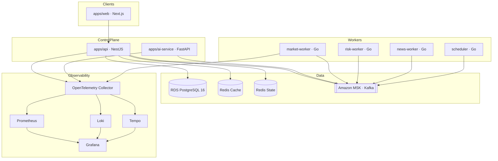

# AI-TOS — Project Context

**AI Trading Operating System** · Living project brief for engineers and Cursor agents.

---

## 1. Vision

AI-TOS is a cloud-native, modular, event-driven **AI Trading Operating System**. The long-term product goal is a production-grade platform that ingests market and news signals, applies AI decision engines under strict risk controls, and executes/reconciles trades with full auditability and observability.

**Phase 0 constraint:** the repository currently contains the **engineering foundation only** — monorepo, services scaffolds, infrastructure, CI/CD, security, and observability. No trading, market analysis, or AI decision business logic is implemented in Phase 0.

---

## 2. Architecture

AI-TOS is organized as a **pnpm + Turbo monorepo** with independently deployable applications and shared libraries, backed by AWS infrastructure (Terraform) and Kubernetes delivery (Helm + Kustomize + Argo CD).



### Layers

| Layer | Components | Role |
|---|---|---|
| Presentation | `apps/web` | Dashboard shell, auth UI (no trading UI in Phase 0) |
| API | `apps/api` | REST + future WS, RBAC, audit, Swagger, `/health` |
| AI | `apps/ai-service` | LLM provider adapter interfaces (no decision logic) |
| Workers | `apps/{market,risk,news,scheduler}-worker` | Go health + event-consumer skeletons |
| Shared libs | `packages/*` | Types, config, UI, SDK, database |
| Events | Amazon MSK (Kafka) | Durable, ordered, replayable backbone |
| Data | RDS PostgreSQL 16 + split Redis | OLTP system of record; cache vs state separation |
| Delivery | EKS + Helm + Kustomize + Argo CD | GitOps promotion across environments |
| Observability | OTel → Prometheus / Loki / Tempo + Grafana | Metrics, logs, traces, dashboards, alerts |

---

## 3. Technologies

| Area | Choice |
|---|---|
| Package management | pnpm workspaces |
| Build orchestration | TurboRepo |
| Languages | TypeScript, Python 3.11+, Go 1.22+ |
| Web | Next.js 14 (App Router) |
| API | NestJS 10 |
| AI service | FastAPI |
| Workers | Go |
| Primary database | Amazon RDS for PostgreSQL 16 |
| Cache / state | ElastiCache Redis (split: cache + state) |
| Event backbone | Apache Kafka on Amazon MSK |
| Schema governance | AWS Glue Schema Registry (Avro) |
| Container platform | Amazon EKS |
| IaC | Terraform (remote state: S3 + DynamoDB) |
| K8s packaging | Helm + Kustomize |
| GitOps | Argo CD |
| Secrets | AWS Secrets Manager + KMS + External Secrets Operator |
| Observability | OpenTelemetry, Prometheus, Grafana, Loki, Tempo, Alertmanager |
| CI/CD | GitHub Actions (OIDC → AWS) |
| Local stack | Docker Compose / Make |

See also: `docs/technology-matrix.md`, `docs/adrs/`.

---

## 4. Engineering Principles

1. **Independence** — each `apps/*` is independently deployable and failure-isolated.
2. **Contracts first** — shared types and Zod schemas in `@ai-tos/shared` are the API/SDK contract.
3. **No Phase 0 business logic** — foundation, health, scaffolding, and platform only.
4. **Observability by default** — `/health`, structured logs, metrics, and traces on every service.
5. **Security by default** — RBAC, Helmet, CORS, rate limits, secrets via SM/ESO (never in git).
6. **Infrastructure as code** — Terraform modules are the source of truth for cloud resources.
7. **GitOps delivery** — Helm charts + Kustomize overlays; promote images, not rebuilds.
8. **Phase discipline** — implement only the requested phase; freeze completed phases.
9. **Production quality** — no TODOs, placeholders, mocks, or incomplete deliverables in shipped work.
10. **Credit-efficient engineering** — minimal exploration, smallest viable diffs, validate, stop.

---

## 5. Cursor Workflow

Cursor agents implement AI-TOS under strict phase and scope rules:

| Rule | Practice |
|---|---|
| Scope | Implement **only** the phase named in the prompt |
| Frozen work | Do not redesign or refactor completed phases unless fixing a verified bug |
| Architecture | Preserve monorepo layout, package names, and public APIs |
| Docs vs code | Modify only what the task requires; documentation tasks must not change application code |
| Validation | Prefer package-level checks; run `pnpm build`, `pnpm typecheck`, `terraform validate`, `helm template` when in scope |
| Completion | When the phase deliverables pass validation — **stop** and wait for the next instruction |
| Ambiguity | Do not invent architecture; stop and request clarification |

**Agent entry points for continuity:**

| File | Purpose |
|---|---|
| `docs/project/PROJECT_CONTEXT.md` | Vision, architecture, workflow (this file) |
| `docs/project/PROJECT_STATUS.md` | Live status snapshot |
| `docs/project/ROADMAP.md` | Full phase checklist |
| `docs/project/DECISIONS.md` | ADR-style decision log |
| `docs/project/CHANGELOG.md` | Semantic version history |
| `docs/project/NEXT_TASK.md` | Exact current phase objective and validation gates |

---

## 6. Git Workflow

| Practice | Detail |
|---|---|
| Branching | Trunk-based; `main` always releasable |
| Feature branches | `feat/<slug>`, `fix/<slug>`, `chore/<slug>`, `docs/<slug>`, `release/x.y` |
| Commits | Conventional Commits (commitlint + Husky) |
| Reviews | PR template + CODEOWNERS approval |
| CI gates | lint, typecheck, build, test, Python/Go checks, terraform fmt/validate, security scans |
| Merge | Squash-merge to `main` |
| Release | semantic-release on `main` → version bump + git tag |
| Hotfix | `release/x.y` branch, forward-merged to `main` |

Details: `docs/git-workflow.md`, `docs/branch-strategy.md`, `docs/release-strategy.md`.

---

## 7. Repository Structure

```
ai-tos/
├── apps/                  # Independently deployable services
├── packages/              # Shared TypeScript libraries
├── infrastructure/        # Terraform, Docker, Kubernetes
├── .github/               # Workflows, templates, policies
├── docs/                  # Architecture, ADRs, onboarding, project system
├── scripts/               # Bootstrap, migrate, seed, dev helpers
├── Makefile               # Common DX targets
├── Taskfile.yaml          # Task runner alternatives
├── package.json           # Root workspace + Turbo scripts
├── pnpm-workspace.yaml    # Workspace membership
└── turbo.json             # Pipeline graph
```

---

## 8. Major Folder Purpose

| Path | Purpose |
|---|---|
| `apps/web` | Next.js dashboard shell (auth UI, theming; no trading UI in Phase 0) |
| `apps/api` | NestJS REST API foundation (RBAC, audit, Swagger, health) |
| `apps/ai-service` | Python FastAPI LLM adapter interfaces |
| `apps/market-worker` | Go market event consumer skeleton |
| `apps/risk-worker` | Go risk event consumer skeleton |
| `apps/news-worker` | Go news event consumer skeleton |
| `apps/scheduler` | Go scheduler skeleton |
| `packages/shared` | Cross-cutting types and Zod schemas (contracts) |
| `packages/config` | Validated environment schema and constants |
| `packages/ui` | Shared UI component library (Tailwind + cva) |
| `packages/sdk` | Typed API client |
| `packages/database` | PostgreSQL pool, migrations, seeds |
| `infrastructure/terraform` | AWS IaC (bootstrap + foundation modules/environments) |
| `infrastructure/docker` | Dockerfiles and local docker-compose stack |
| `infrastructure/kubernetes` | Helm chart, Kustomize overlays, EKS foundation manifests, legacy YAML |
| `.github` | GitHub Actions CI/CD, PR templates, policies |
| `docs` | Architecture, onboarding, ADRs, diagrams, standards |
| `docs/adrs` | Immutable Architecture Decision Records |
| `docs/project` | Living project documentation system (context, status, roadmap) |
| `scripts` | Developer and ops helper scripts |

---

## Related Documents

- `docs/architecture.md`
- `docs/architecture-readiness-report.md`
- `docs/repo-architecture-and-plan.md`
- `docs/adrs/README.md`
- `docs/project/ROADMAP.md`
