# AI-TOS — Engineering Roadmap

Complete roadmap from Phase **0A** through **production release (GA)**.

**Legend:** ✅ Complete · ⬜ Not started · 🔄 In progress

---

## Phase 0 — Platform Foundation

No trading or AI decision business logic. Deliver a production-grade scaffold and cloud platform.

### Phase 0A — Engineering Foundation

- [x] ✅ Monorepo (pnpm workspaces + TurboRepo)
- [x] ✅ Shared packages (`shared`, `config`, `ui`, `sdk`, `database`)
- [x] ✅ Application scaffolds (web, api, ai-service, Go workers)
- [x] ✅ Local Docker Compose / Make DX
- [x] ✅ Helm + Kustomize scaffolding; legacy YAML isolation
- [x] ✅ GitHub Actions CI scaffold (lint/typecheck/build/test)
- [x] ✅ Architecture Review Board ADRs (0001–0012)
- [x] ✅ Health + contract test strategy baseline

### Phase 0B — Cloud & Runtime Platform

#### 0B.1 — AWS Cloud Foundation

- [x] ✅ AWS Organizations multi-account baseline
- [x] ✅ Multi-AZ 3-tier VPC (primary + DR region strategy)
- [x] ✅ IAM / OIDC / least-privilege roles
- [x] ✅ KMS CMKs, S3 artifact/log/backup buckets
- [x] ✅ Security baseline (CloudTrail, Config, GuardDuty, Security Hub)
- [x] ✅ Cost allocation tags + budgets
- [x] ✅ ADR-0013

#### 0B.2 — EKS Kubernetes Platform

- [x] ✅ EKS cluster (private API, managed node groups)
- [x] ✅ IRSA, Cluster Autoscaler, Metrics Server
- [x] ✅ AWS Load Balancer Controller
- [x] ✅ Namespaces + Pod Security Standards
- [x] ✅ Network policies / RBAC / storage classes
- [x] ✅ ADR-0014

#### 0B.3 — Data Platform

- [x] ✅ RDS PostgreSQL 16 (Multi-AZ, PITR, KMS, Secrets Manager)
- [x] ✅ Redis cache cluster (volatile / LRU)
- [x] ✅ Redis state cluster (durable / AOF)
- [x] ✅ Backup + encryption alignment
- [x] ✅ ADR-0015

#### 0B.4 — Event Platform

- [x] ✅ Amazon MSK (Kafka 3.6, Multi-AZ, IAM + SCRAM, TLS)
- [x] ✅ Topic / DLQ / retry surface as code
- [x] ✅ Glue Schema Registry (Avro) strategy
- [x] ✅ ADR-0016

#### 0B.5 — Secrets & Delivery Platform

- [x] ✅ Secrets Manager + KMS + External Secrets Operator patterns
- [x] ✅ Helm chart + Kustomize overlays (dev/staging/prod)
- [x] ✅ GitOps delivery baseline (Argo CD-ready packaging)
- [x] ✅ Service identity / IRSA binding readiness
- [x] ✅ Platform foundation gate through 0B.5 (`v0.5.0`)

#### 0B.6 — Observability Platform *(current)*

- [ ] ⬜ Prometheus (metrics scrape / AMP path)
- [ ] ⬜ Grafana (dashboards-as-code)
- [ ] ⬜ Loki (structured log aggregation)
- [ ] ⬜ Tempo (distributed tracing backend)
- [ ] ⬜ OpenTelemetry Collector + service instrumentation baseline
- [ ] ⬜ Alertmanager / alerting rules for platform SLOs
- [ ] ⬜ Validation: `terraform validate` · `helm template` · `pnpm build` · `pnpm typecheck`

#### 0B.7 — CI/CD Production Gates & Environment Promotion

- [ ] ⬜ OIDC-authenticated Terraform plan/apply environments
- [ ] ⬜ Image SBOM + signing enforcement
- [ ] ⬜ SAST / dependency / container / IaC scan gates
- [ ] ⬜ Protected GitHub Environments (staging/prod reviewers)
- [ ] ⬜ Smoke tests post-deploy

#### 0B.8 — Resilience, DR & Runbooks

- [ ] ⬜ RPO/RTO runbooks (RDS PITR, Redis, MSK, state CRR)
- [ ] ⬜ Multi-AZ failure drills (staging)
- [ ] ⬜ Backup restore verification
- [ ] ⬜ On-call alert routing + severity taxonomy
- [ ] ⬜ Phase 0 platform exit criteria signed off

---

## Phase 1 — Identity, Auth & Core Services

Wire real identity and deploy core control-plane services onto the platform.

- [ ] ⬜ Entra ID / OIDC identity provider integration
- [ ] ⬜ User store + session model (`redis-state`)
- [ ] ⬜ RBAC roles/permissions hardened end-to-end
- [ ] ⬜ API + Web authenticated deploy to EKS (dev → staging)
- [ ] ⬜ Audit log persistence (PostgreSQL)
- [ ] ⬜ Outbox relay foundation (Debezium / relay pattern)
- [ ] ⬜ Contract tests in CI (OpenAPI + shared types)
- [ ] ⬜ Integration tests (Testcontainers: Postgres + Kafka)

---

## Phase 2 — Market Data Platform

Ingest, normalize, and store market data without execution.

- [ ] ⬜ Market data provider adapters (vendor-agnostic interfaces)
- [ ] ⬜ `market-worker` producers/consumers on Kafka
- [ ] ⬜ Candle / tick schemas in Schema Registry
- [ ] ⬜ Dedicated time-series tier design (TimescaleDB path)
- [ ] ⬜ Market data APIs (read models)
- [ ] ⬜ Replay tooling for Kafka topics
- [ ] ⬜ SLO dashboards for ingest lag / freshness

---

## Phase 3 — AI Decision Engine

Introduce AI reasoning behind strict contracts and audit trails.

- [ ] ⬜ Prompt / tool / model adapter contracts in `ai-service`
- [ ] ⬜ Decision event schemas (input features → recommendation)
- [ ] ⬜ Model provider routing (OpenAI / Gemini / Claude interfaces)
- [ ] ⬜ Guardrails: content safety, schema validation, timeout budgets
- [ ] ⬜ Decision audit trail (who/what/why/model/version)
- [ ] ⬜ Shadow mode (recommendations without execution)
- [ ] ⬜ Evaluation harness (offline + online)

---

## Phase 4 — Risk Management

Enforce risk before any order leaves the system.

- [ ] ⬜ `risk-worker` real risk evaluation pipeline
- [ ] ⬜ Position, exposure, concentration, and drawdown limits
- [ ] ⬜ Pre-trade risk checks as mandatory Kafka/API gates
- [ ] ⬜ Kill-switch / circuit-breaker controls
- [ ] ⬜ Risk override audit + dual-control for privileged actions
- [ ] ⬜ Risk SLO alerts (reject rate, latency, DLQ depth)

---

## Phase 5 — Execution & Broker Integration

Connect approved decisions to brokers with idempotent execution.

- [ ] ⬜ Broker adapter interfaces (paper + live)
- [ ] ⬜ Order state machine (new → acknowledged → filled / cancelled / rejected)
- [ ] ⬜ Idempotent order keys + exactly-once intent patterns
- [ ] ⬜ Fill / partial-fill reconciliation
- [ ] ⬜ Execution quality metrics
- [ ] ⬜ Paper-trading environment parity with prod topology

---

## Phase 6 — Portfolio, Reporting & News Intelligence

- [ ] ⬜ Portfolio positions / PnL read models
- [ ] ⬜ `news-worker` ingestion + relevance scoring
- [ ] ⬜ Reporting APIs and dashboard views
- [ ] ⬜ Scheduled jobs via `scheduler` (EOD, risk snapshots)
- [ ] ⬜ Export / compliance report packs
- [ ] ⬜ Tenant-aware reporting filters

---

## Phase 7 — Multi-Tenancy & Enterprise Controls

- [ ] ⬜ Row-level tenancy model finalized and enforced
- [ ] ⬜ Per-tenant quotas, rate limits, and cost attribution
- [ ] ⬜ Enterprise SSO / SCIM (as required)
- [ ] ⬜ Data residency / retention policies
- [ ] ⬜ Admin console for tenant operations
- [ ] ⬜ Chaos engineering in staging (Litmus / Chaos Mesh)

---

## Phase 8 — Production Hardening & GA

- [ ] ⬜ Performance baselines (k6) meet published SLOs
- [ ] ⬜ Canary releases with auto-rollback
- [ ] ⬜ Full DR failover proven (RPO/RTO targets met)
- [ ] ⬜ Security pen-test remediation closed
- [ ] ⬜ Production runbooks + on-call playbooks complete
- [ ] ⬜ Legal / compliance sign-off for live trading scope
- [ ] ⬜ **GA / Production Release** (`v1.0.0`)

---

## Roadmap Diagram

```mermaid
flowchart LR
  P0A[0A Foundation] --> P0B1[0B.1 Cloud]
  P0B1 --> P0B2[0B.2 EKS]
  P0B2 --> P0B3[0B.3 Data]
  P0B3 --> P0B4[0B.4 Event]
  P0B4 --> P0B5[0B.5 Secrets/Delivery]
  P0B5 --> P0B6[0B.6 Observability]
  P0B6 --> P0B7[0B.7 CI/CD Gates]
  P0B7 --> P0B8[0B.8 DR/Runbooks]
  P0B8 --> P1[Phase 1 Identity]
  P1 --> P2[Phase 2 Market]
  P2 --> P3[Phase 3 AI]
  P3 --> P4[Phase 4 Risk]
  P4 --> P5[Phase 5 Execution]
  P5 --> P6[Phase 6 Portfolio]
  P6 --> P7[Phase 7 Tenancy]
  P7 --> P8[Phase 8 GA]
```

---

## Completion Policy

1. A phase is complete only when all deliverables are implemented and validation commands succeed.
2. Do **not** start the next phase until the current phase is marked complete in this file and in `PROJECT_STATUS.md`.
3. Stop after the phase named in `NEXT_TASK.md` unless explicitly instructed otherwise.
