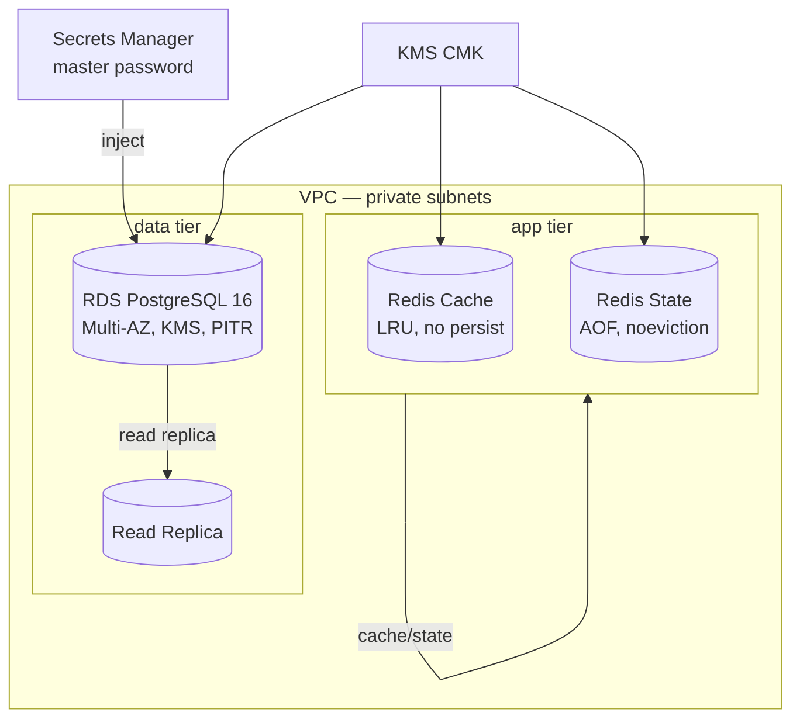
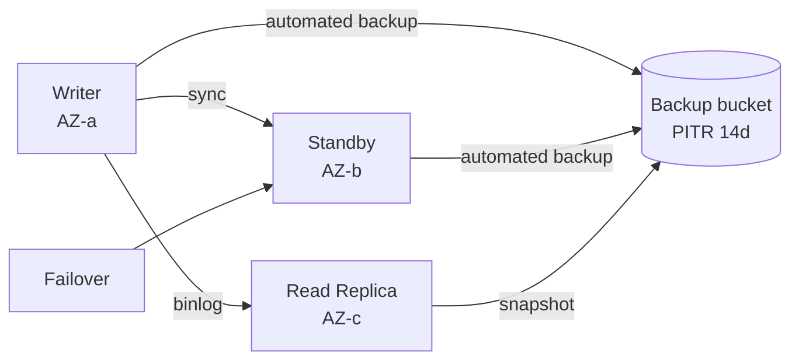
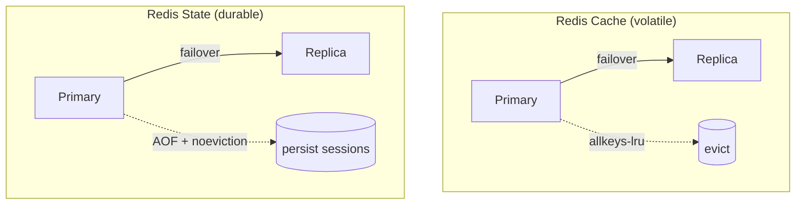
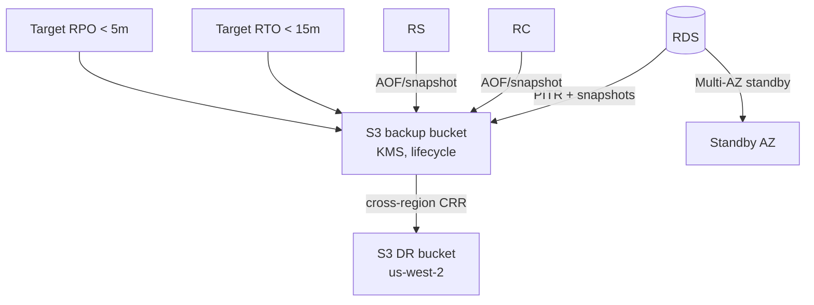

# Data Platform Architecture — Diagrams (Phase 0B.3)

Mermaid diagrams for the AI-TOS data foundation. No Kafka/MSQ/event streaming here (ADR-0004).

## D1 — Data platform overview


## D2 — RDS High Availability & backups


## D3 — Redis topology (split per ADR-0005)

- **Cache:** `allkeys-lru`, `snapshot_retention_limit=0` (disposable).
- **State:** `noeviction` + AOF (`appendonly=yes`), 1 snapshot (sessions survive recycle).

## D4 — Backup / DR architecture


## D5 — Security
```mermaid
flowchart TB
  APP[Apps / Services] -->|TLS 1.2+| RDS
  APP -->|TLS| RC & RS
  SG[Security Groups\n5432 / 6379 only] --> RDS & RC & RS
  KMS[KMS CMK] -->|encrypt at rest| RDS & RC & RS
  SM[Secrets Manager\nmanaged master pwd + rotation] --> RDS
  IAM[IAM auth\n+ least-privilege roles] --> RDS
  CLOUDTRAIL[CloudTrail + RDS logs\n(central log bucket)] --> AUDIT[(Shared Services audit)]
```
