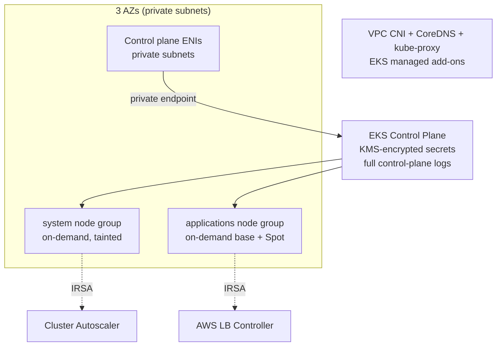
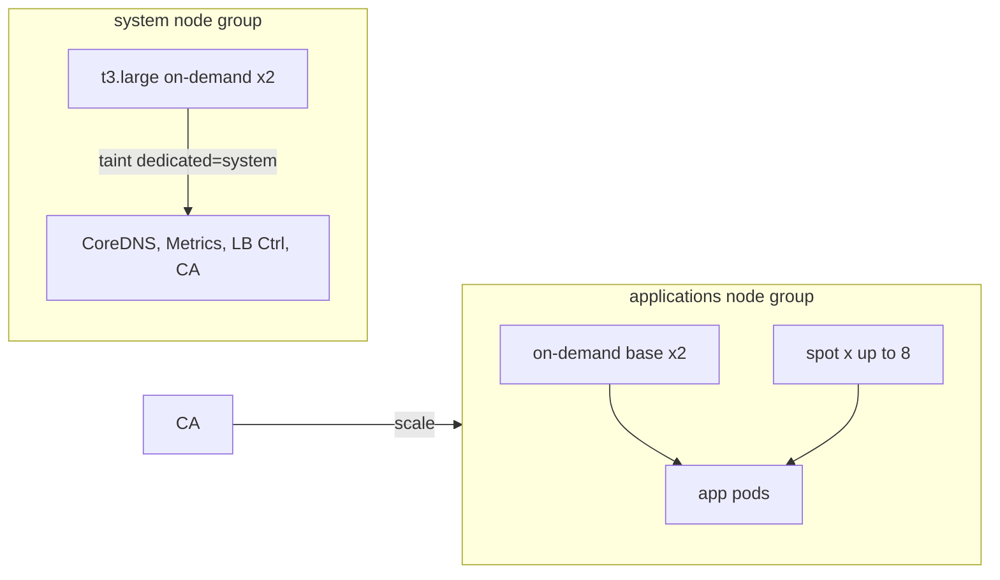
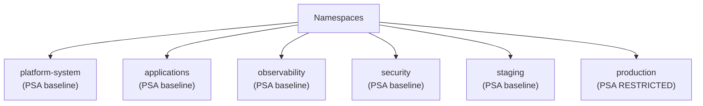
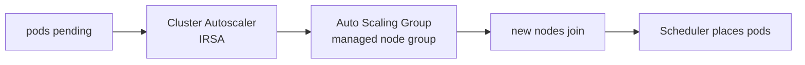

# EKS Platform Architecture — Diagrams (Phase 0B.2)

Mermaid diagrams for the AI-TOS Kubernetes platform. No workloads are shown (platform only).

## E1 — Cluster architecture


## E2 — Node groups & capacity


## E3 — Namespaces


## E4 — Networking & ingress foundation
```mermaid
flowchart TB
  IGW[Internet GW] --> ALB[ALB (AWS LB Controller)\nprovisions per Ingress later]
  ALB --> SVC[Service / pod in applications]
  APP[application pods] -->|egress| NAT[NAT GW]
  APP -->|DNS| COREDNS[CoreDNS]
  VPCN[VPC CNI] -->|pod ENI in private subnets| APP
  NP[default-deny NetworkPolicy\napplications/observability/security]
  IRSA[IRSA: CA + LB Controller\nassume AWS roles]
  KMS[KMS: secrets encryption at rest]
```

## E5 — Autoscaling flow

