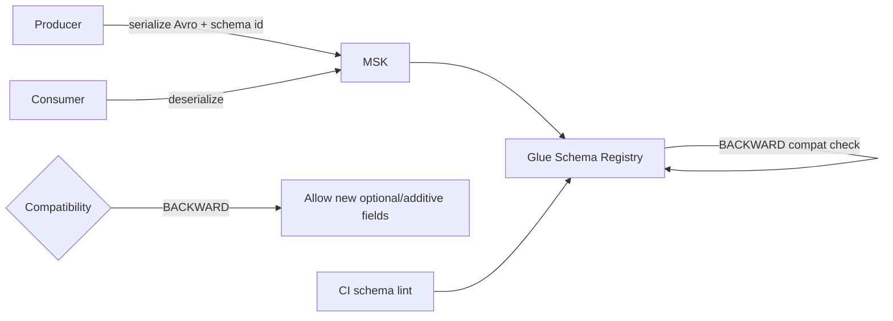
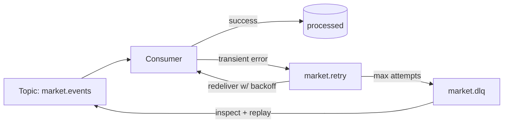
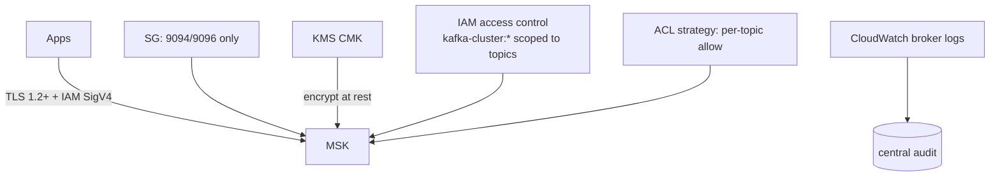

# Event Platform Architecture — Diagrams (Phase 0B.4)

Mermaid diagrams for the AI-TOS event platform (MSK/Kafka). No producers/consumers here.

## D1 — Event platform overview
```mermaid
flowchart TB
  subgraph VPC["VPC — private subnets"]
    MSK[(Amazon MSK\nKafka 3.6, Multi-AZ, KMS, TLS)]
    SR[Glue Schema Registry\nAvro, versioned]
  end
  PROD[Producers\n(apps, 0B.5)] -->|IAM auth + TLS| MSK
  MSK -->|events| CONS[Consumers\n(apps, 0B.5)]
  PROD & CONS -. validate .-> SR
  KMS[KMS CMK] --> MSK
  IAM[IAM access control] --> MSK
```

## D2 — Kafka broker topology (Multi-AZ)
```mermaid
flowchart LR
  subgraph AZa["AZ-a"]
    B1[Broker 1]
  end
  subgraph AZb["AZ-b"]
    B2[Broker 2]
  end
  subgraph AZc["AZ-c"]
    B3[Broker 3]
  end
  B1 <->|replication RF=3| B2
  B2 <-> B3
  B1 <-> B3
  ZK[Controller election across AZs] --> B1 & B2 & B3
```

## D3 — Topic strategy
```mermaid
flowchart TB
  DOM[Domain prefixes]
  DOM --> M[market.*] & P[portfolio.*] & R[risk.*] & A[audit.*] & N[notification.*] & S[system.*]
  M --> MD[market.events / .dlq / .retry]
  R --> RD[risk.events / .dlq / .retry]
  A --> AD[audit.events / .dlq]
  style DOM fill:#eee
  note right of MD: partitions 12, RF3, 7d
  note right of RD: partitions 12, RF3, 14d
  note right of AD: partitions 6, RF3, 90d
```

## D4 — Schema Registry (recommended: Glue Schema Registry + Avro)

- **Avro** chosen: compact binary, mature Kafka tooling, first-class schema evolution.
- **Protobuf** alternative where strongly-typed/gRPC payloads dominate.
- **JSON Schema** only for human-readable/debug topics (larger payloads).
- **Compatibility:** BACKWARD by default (new schema can read old data); per-topic override allowed.
- **Governance:** registry write perms gated; CI validates schema PRs; registry read for consumers.

## D5 — DLQ / retry architecture

- Retry topics use capped redelivery + exponential backoff (consumer-side, 0B.5).
- Poison messages (schema/parse failures) skip retry and go straight to `.dlq`.
- Replay: re-publish from `.dlq` to the source topic after fix.

## D6 — Security

- **Auth:** IAM for clients (least privilege, no static creds) + SCRAM for platform tooling.
- **TLS:** in transit enforced (`client_broker=TLS`, `in_cluster=true`).
- **Authorization:** IAM policies / MSK ACLs scoped to `cluster + <domain>.*` topics.
- **Encryption:** KMS at rest; TLS in transit.
- **Audit:** broker logs to CloudWatch.
