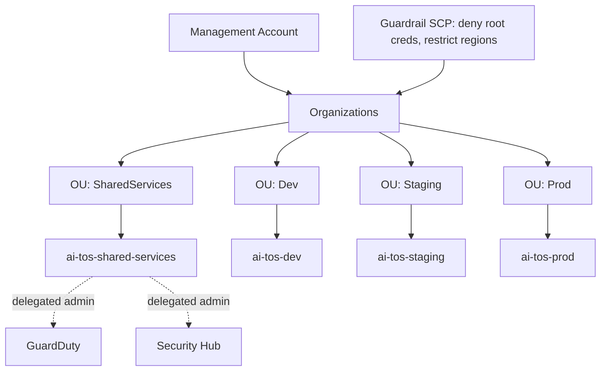
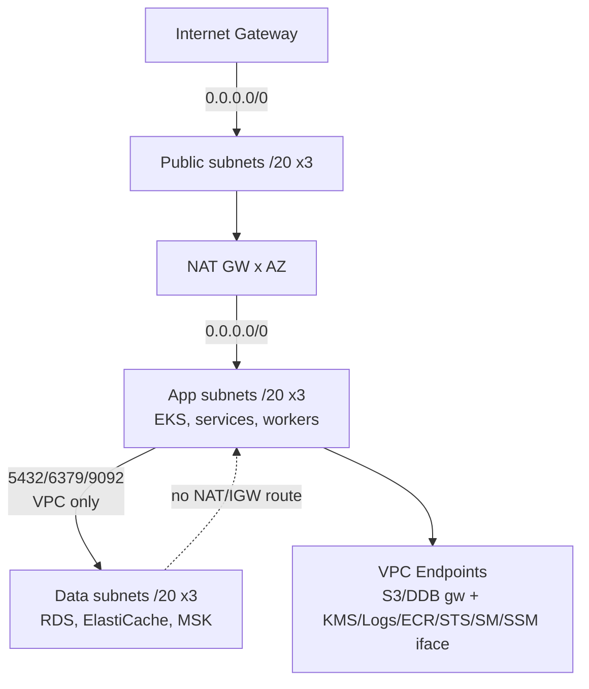
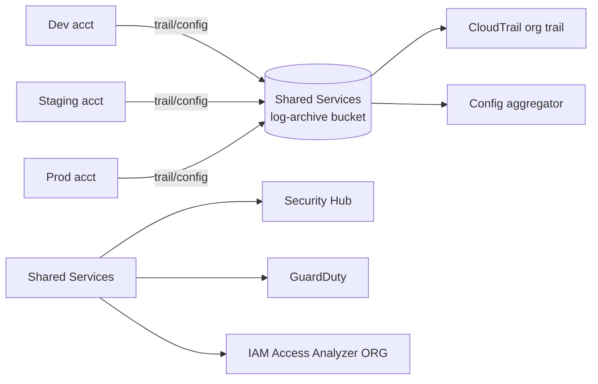
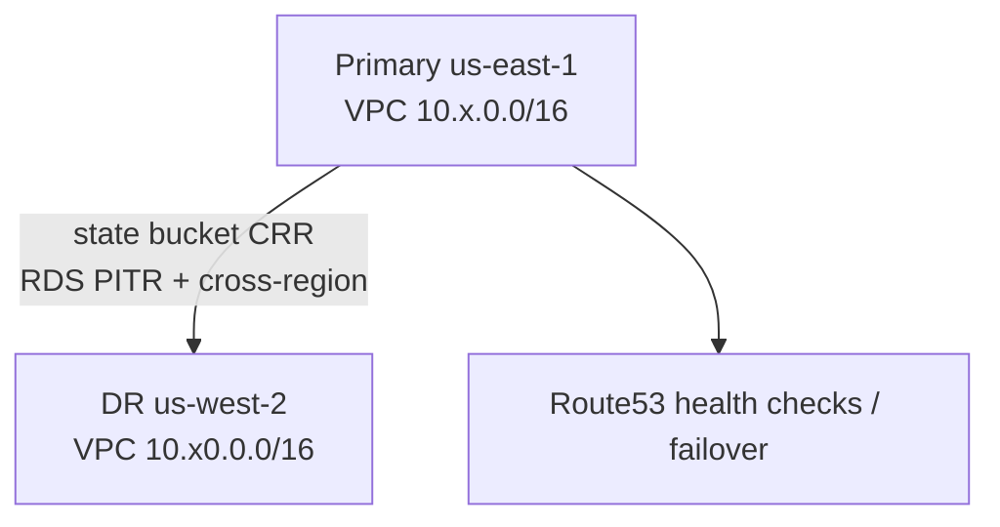
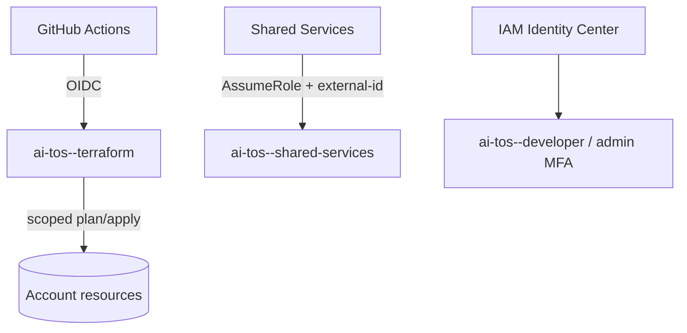

# Network & Architecture Diagrams (Phase 0B.1)

Mermaid diagrams for the AI-TOS cloud foundation.

## N1 — Account / Org structure

## N2 — VPC tiers & routing

## N3 — Centralized logging & security

## N4 — Region strategy (primary + DR)

## N5 — IAM / OIDC access

